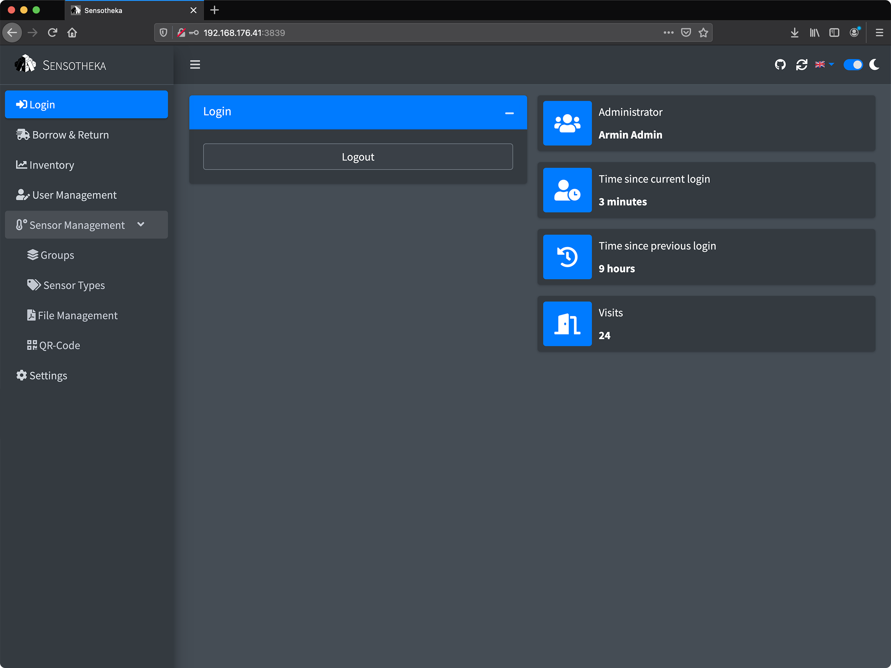
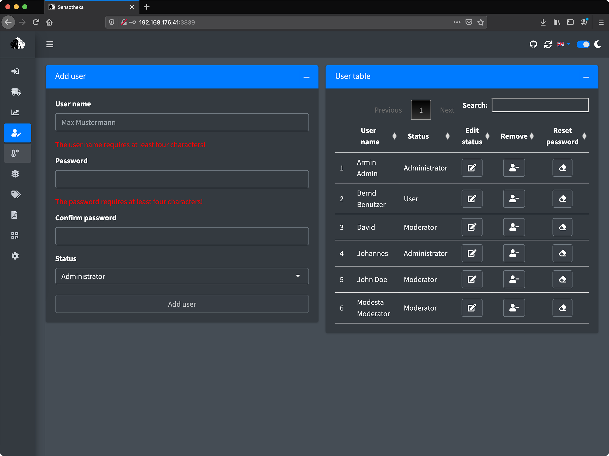
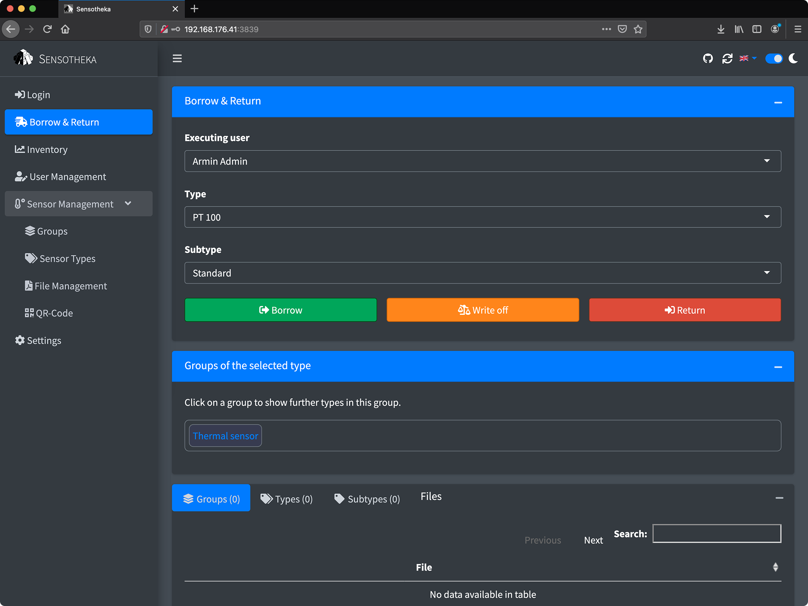
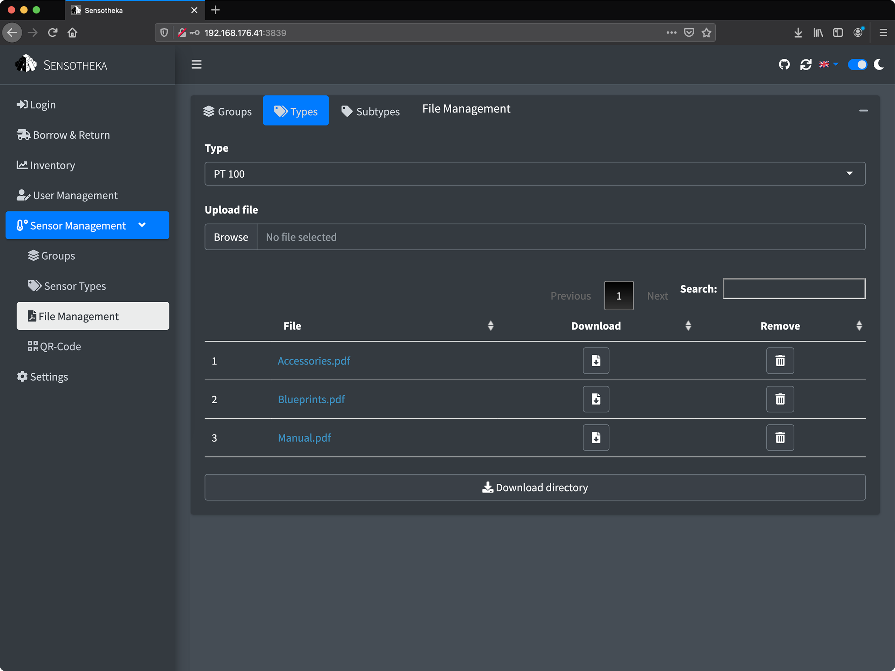
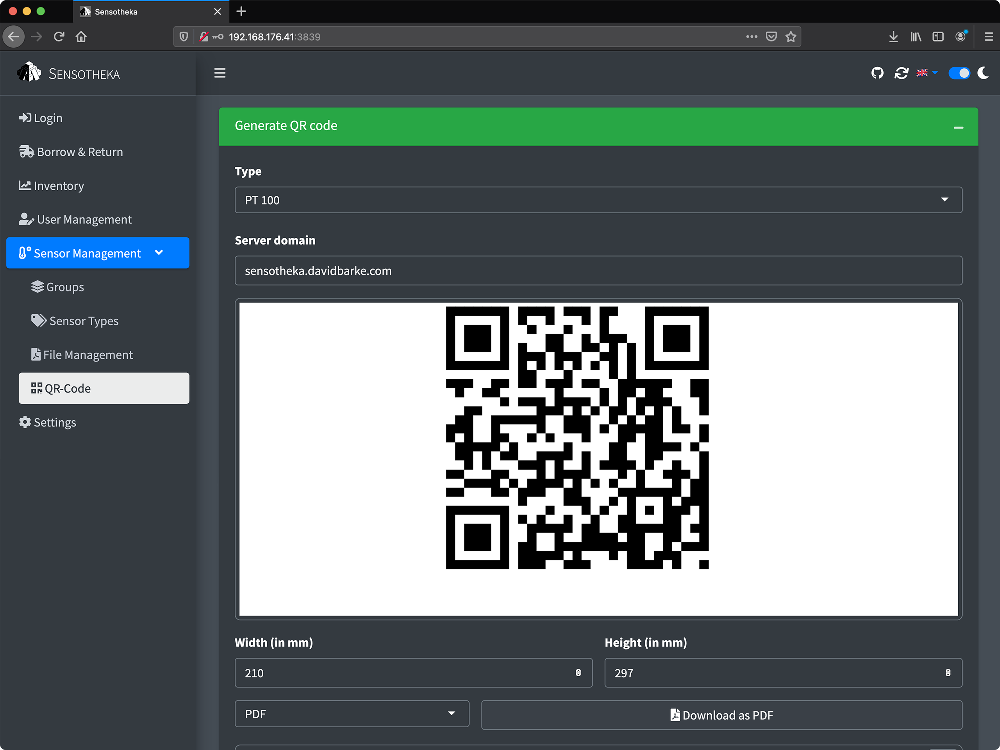

<!-- README.md is generated from README.Rmd. Please edit that file -->

# PFA

<!-- badges: start -->
<!-- badges: end -->

# App Title

Sensotheka - Management of Inventory, Files & Users

## Authors

David Barkemeyer, Johannes Hendrik Lutz Sturm

## Usernames

David\_Barkemeyer

## Keywords

stock-management, user-management, file-management,
internationalization, database-integration

## Category

Other

## URL of deployed app

<a href="https://davidbarke.shinyapps.io/Sensotheka/" class="uri">https://davidbarke.shinyapps.io/Sensotheka/</a>

## URL of source code

<a href="https://github.com/PFA-WebApp/App" class="uri">https://github.com/PFA-WebApp/App</a>

## URL of RStudio Cloud project with app

<a href="https://rstudio.cloud/project/2495352" class="uri">https://rstudio.cloud/project/2495352</a>

## Short Description

Sensotheka supports the Department of Vehicle Propulsion Systems at the
TU Berlin in managing its sensors. A SQLite database manages users,
sensors and transactions. Sensors can be borrowed and returned via QR
codes.

## Long description

### Contents

1.  Background
2.  User Management
3.  Sensor Management
4.  File Management
5.  QR Codes
6.  Internationalization
7.  Cookies

### 1. Background

Every semester, the Department of Vehicle Propulsion Systems at TU
Berlin offers the so-called “Propulsion Systems Project”, in which
students can work on one of the department’s various projects. In the
winter semester 2020/21, the development of a web application to manage
the sensors of the department was tendered. Since no particular
framework was given and Johannes and I both have some experience working
with Shiny, we decided to take on this project and develop the Shiny
application presented here.

### 2. User Management

There are three different user roles: *User*, *Moderator* and
*Administrator*. Depending on the user role, different tabs are visible
in the sidebar and many operations differ depending on the user role.For
example, an *Administrator* can borrow and return sensors for any user,
while a *User* can only perform transactions for themselves.

### 3. Sensor Management

Relationships between sensors are mapped using a three-part hierarchy. A
given sensor is a *Subtype*. *Subtypes* that have the same functionality
but differ in size or manufacturer are all part of the same *Type*.
*Types* that form an experimental setup can be grouped into a *Group*.
*Administrators* can add, modify, and remove entities at any level of
the introduced hierarchy.

### 4. File Management

*Administrators* can upload PDF files for each step of the hierarchy.
These are all stored in separate subdirectories of the ‘files’
directory. All users can then download these files. File contents are
e.g. data sheets for specific sensors or theoretical backgrounds for
experimental setups.

### 5. QR Codes

*Administrators* can create QR codes for *Types*. These QR codes are
printed and stored in the sensor warehouse. If a user scans one of them
with a QR reader, they will be redirected to the *Borrowing & Returning*
tab and the scanned *Type* will already be selected. For this
functionality, the query string of the URL is processed.

### 6. Internationalization

The user interface of the application we developed for the project was
exclusively in German. For our contribution to the contest, we decided
to internationalize all the code and localize it in English, Spanish and
French - languages that we or friends of ours know and whose grammatical
structure has similarities with German. We first tried the {shiny.i18n}
package, but missed some features like interpolation and parameterized
keys, so we decided to build our own {i18n} package that takes some
ideas from the above package and develops them further. The language
selector in the upper right corner allows a quick and live language
change.

### 7. Cookies

There are two cookies that store client data:

-   `user`: the encrypted username so that a user can be logged in
    automatically as long as this cookie does not expire.
-   `dark-mode`: The dark mode setting, so that the dark mode is set
    accordingly when the application is started.

## Thumbnail Image

## Screenshot of app (large)

